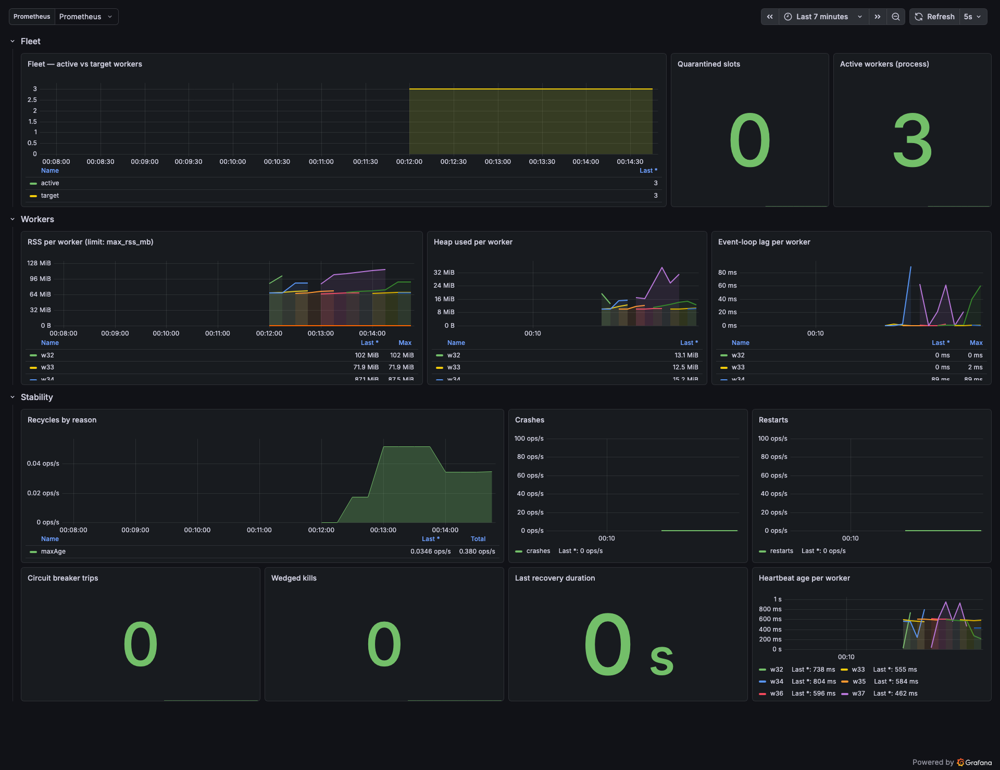

# clusterkit

[](./LICENSE)
[](https://nodejs.org)
[](https://github.com/Goopil/clusterkit/actions/workflows/ci.yml)
[](https://sonarcloud.io/dashboard?id=Goopil_clusterkit)
[](https://codecov.io/gh/Goopil/clusterkit)
[](https://www.npmjs.com/package/@goopil/clusterkit)
[](https://www.npmjs.com/package/@goopil/clusterkit)

Multi-worker Node.js, made boring.

ClusterKit forks your app one worker per core, balances connections at the kernel level, restarts crashed workers with
backoff, and drains them cleanly on shutdown. Bring your web framework — the supervision is handled.

## Getting started in 5 minutes

```bash
pnpm add @goopil/clusterkit
```

Create `server.js`:

```js
import {createServer} from 'node:http';
import {Orchestrator} from '@goopil/clusterkit';

const orchestrator = new Orchestrator({logger: console});

orchestrator.run(async () => {
  const capabilities = await Orchestrator.getCapabilities();

  // This callback runs in every worker process
  const server = createServer((_req, res) => {
    res.end(`hello from pid ${process.pid}`);
  });

  server.listen({
    port: 3000,
    host: '0.0.0.0',
    // On Linux with SO_REUSEPORT: each worker binds directly, the kernel balances.
    // On macOS / without SO_REUSEPORT: cluster IPC handles distribution.
    reusePort: capabilities.reusePort,
    exclusive: capabilities.reusePort,
  });

  orchestrator.registerOnShutdown(() => server.close());
});
```

```bash
node server.js
```

On Linux you get one worker per core, each accepting connections directly. On macOS, force multi-worker mode with
`WEB_CONCURRENCY=4`.

What you just got:

- **Kernel-level load balancing** — workers bind the same port with `SO_REUSEPORT` and the kernel distributes
  connections; no primary-as-proxy bottleneck.
- **Crash recovery** — exponential backoff with a sliding-window circuit breaker.
- **Graceful shutdown** — per-worker ACK protocol with `SIGTERM → SIGINT → SIGKILL` escalation.

## Level 1 — Ready to deploy

**Worker count.** `workers.count: 'auto'` (the default) reads `WEB_CONCURRENCY`, or falls back to
`os.availableParallelism()`. Set an explicit number when you know better. The full resolution rules are in the
[core README](./packages/worker-manager/README.md#worker-count).

**Health checks.** Expose readiness to Kubernetes or any supervisor:

```ts
const {ready, live} = orchestrator.getHealth();
// ready = false during shutdown, after a circuit-breaker trip, or via setNotReady()
```

**Shutdown budget.** Set `shutdown.timeoutMs` below your platform's grace period (for example Kubernetes
`terminationGracePeriodSeconds`) so escalation to `SIGKILL` happens inside the budget:

```ts
const orchestrator = new Orchestrator({
  shutdown: {timeoutMs: 10_000},
});
```

Everything else — full configuration, API, events, security guards — lives in the
[core README](./packages/worker-manager/README.md).

## Level 2 — Observability

**Prometheus.** Merged orchestration + worker metrics behind one endpoint:

```bash
pnpm add @goopil/clusterkit-prometheus prom-client
```

```js
import {createPrometheusPlugin} from '@goopil/clusterkit-prometheus';

const prometheus = createPrometheusPlugin({prefix: 'clusterkit_'});
orchestrator.use(prometheus).run(async () => { /* your app */ });

// Binds in the primary only: GET /metrics + GET /healthz
await prometheus.serve({port: 9090, host: '127.0.0.1'});
```

Options and the full metric list: [plugin README](./packages/plugin-prometheus/README.md).

**OpenTelemetry.** Push the same metrics to any OTLP collector:

```js
import {createOtlpMeterPlugin} from '@goopil/clusterkit-otlp-meter';

orchestrator.use(createOtlpMeterPlugin({
  endpoint: 'http://otel-collector:4318/v1/metrics',
  serviceName: 'my-app',
}));
```

Details: [plugin README](./packages/plugin-otlp-meter/README.md).

**Container sizing.** On Kubernetes or Docker, `@goopil/clusterkit-sizing` reads cgroup v1/v2 limits and computes both
the worker count and each worker's `--max-old-space-size`:

```js
import {createContainerSizingPlugin} from '@goopil/clusterkit-sizing';

const sizing = createContainerSizingPlugin();
orchestrator.use(sizing).run(async () => { /* your app */ });
```

After `run()`, inspect the decision — worker count, memory budget per worker, and the exact `NODE_OPTIONS` injected:

```js
console.log(sizing.sizing);
// { workers: 4, memoryPerWorkerMb: 192, v8HeapMb: 144,
//   nodeOptions: '--max-old-space-size=144',
//   source: { cpuLimit: 4, memoryLimitBytes: 805306368, ... } }
```

Details: [plugin README](./packages/plugin-container-sizing/README.md).

**Grafana dashboard.** A ready-made dashboard covering the fleet, per-worker health, and stability metrics ships in
[`grafana/`](./grafana/): import `clusterkit-dashboard.json` into Grafana (pick your Prometheus datasource on import).



It works with either metrics pipeline: the Prometheus plugin's exposition, or the OTLP plugin pushed through a
collector whose Prometheus exporter applies the standard OpenTelemetry name normalization
(`clusterkit.worker.restarts` → `clusterkit_worker_restarts_total`).

## Level 3 — Automation

**Hot restart on signal.** `kill -HUP <pid>` rolls workers without dropping connections:

```js
import {createSignalRestartPlugin} from '@goopil/clusterkit-signal-restart';

orchestrator.use(createSignalRestartPlugin());
```

Details: [plugin README](./packages/plugin-signal-restart/README.md).

**Hot restart on file or env change.** Watch source files or `.env` and roll workers:

```js
import {createFileWatcherPlugin} from '@goopil/clusterkit-file-watcher';

orchestrator.use(createFileWatcherPlugin({watch: ['./src'], envFile: './.env'}));
```

Details: [plugin README](./packages/plugin-file-watcher/README.md).

**Custom plugins.** Hook the install/uninstall lifecycle, listen to typed events, patch worker env, or override the
worker count before forking. The `OrchestratorPlugin` interface and helpers are documented in the
[core README](./packages/worker-manager/README.md#plugins).

## Packages

| Package                                   | Description                                               | Detailed docs |
|-------------------------------------------|-----------------------------------------------------------|---------------|
| [`@goopil/clusterkit`](#goopilclusterkit) | Cluster orchestrator — core library                       | [`packages/worker-manager/README.md`](./packages/worker-manager/README.md) |
| [`@goopil/clusterkit-prometheus`](#goopilclusterkit-prometheus) | Prometheus metrics export plugin                          | [`packages/plugin-prometheus/README.md`](./packages/plugin-prometheus/README.md) |
| [`@goopil/clusterkit-sizing`](#goopilclusterkit-sizing) | Kubernetes / container-aware CPU and memory sizing plugin | [`packages/plugin-container-sizing/README.md`](./packages/plugin-container-sizing/README.md) |
| [`@goopil/clusterkit-otlp-meter`](#goopilclusterkit-otlp-meter) | OpenTelemetry OTLP metrics export plugin                  | [`packages/plugin-otlp-meter/README.md`](./packages/plugin-otlp-meter/README.md) |
| [`@goopil/clusterkit-signal-restart`](#goopilclusterkit-signal-restart) | Signal-based hot restart plugin (SIGHUP → rolling restart) | [`packages/plugin-signal-restart/README.md`](./packages/plugin-signal-restart/README.md) |
| [`@goopil/clusterkit-file-watcher`](#goopilclusterkit-file-watcher) | File watcher hot restart plugin (file/env changes → rolling restart) | [`packages/plugin-file-watcher/README.md`](./packages/plugin-file-watcher/README.md) |

This README is the product tour. Each package README is the detailed reference for its capabilities, options, and API
surface.

## Examples

Ten ready-to-run examples live in [`examples/`](./examples/).

| Example                      | Port  | Metrics port (primary) | Description |
|------------------------------|-------|--------------|-------------|
| `examples/express`           | 3000  | 9090         | Express HTTP server |
| `examples/express-otlp`      | 3009  | —            | Express + OTLP metrics (push to collector) |
| `examples/fastify`           | 3001  | 9091         | Fastify HTTP server |
| `examples/hono`              | 3005  | 9092         | Hono HTTP server |
| `examples/koa`               | 3006  | 9093         | Koa HTTP server |
| `examples/nestjs-express`    | 3007  | —            | NestJS (Express adapter) |
| `examples/nestjs-fastify`    | 3008  | —            | NestJS (Fastify adapter) |
| `examples/inertia-ssr`       | 13714 | —            | Inertia + Vue 3 SSR renderer |
| `examples/inertia-ssr-react` | 13715 | —            | Inertia + React 18 SSR renderer |
| `examples/hot-reload`        | 3010  | —            | Signal-based + file watcher hot restart demo |

> The metrics port is bound **in the primary process** by the Prometheus plugin's `serve()` helper (a no-op in
> workers) — one aggregated `/metrics` endpoint for the whole fleet.

**Run all examples at once (Docker):**

```bash
pnpm examples:start
# All servers start inside a single container.
# curl http://localhost:3000      → Express app
# curl http://localhost:9090/metrics → Prometheus metrics (per-worker bind — see note above; binds METRICS_HOST, default 0.0.0.0)
```

**Run a single example locally:**

```bash
cd examples/fastify
pnpm install
pnpm start
```

### NestJS + SO_REUSEPORT

NestJS requires a specific lifecycle to bind the raw server socket with `reusePort`:

**Express adapter:**

```ts
// app.init() registers NestJS routes on the Express app without calling listen()
await app.init();
// Then bind the raw http.Server directly so we can pass reusePort
app.getHttpServer().listen({port: 3007, host: '0.0.0.0', reusePort: true, exclusive: true});
```

**Fastify adapter:**

```ts
await app.init();
// app.init() does NOT call fastify.ready() — hook graph must be compiled explicitly
const fastify = app.getHttpAdapter().getInstance();
await fastify.ready();
fastify.server.listen({port: 3008, host: '0.0.0.0', reusePort: true, exclusive: true});
```

### Inertia SSR server

`examples/inertia-ssr` is a drop-in replacement for `@inertiajs/server`, managed by ClusterKit. It exposes the same HTTP protocol that Laravel calls to render Inertia pages server-side, with full multi-worker support via SO_REUSEPORT.

**Build and start:**

```bash
cd examples/inertia-ssr
pnpm install
pnpm build   # vite build --ssr → dist/server/entry-server.mjs
pnpm start   # ClusterKit starts N workers, each listening on 127.0.0.1:13714
```

**Configure Laravel** to point at this server instead of the default one:

```php
// config/inertia.php
'ssr' => [
    'enabled' => true,
    'url' => 'http://127.0.0.1:13714',
],
```

**Test without Laravel:**

```bash
curl -s -X POST http://127.0.0.1:13714/render \
  -H "Content-Type: application/json" \
  -d '{"component":"Home","props":{"pid":1,"hostname":"local"},"url":"/"}'
```

**Adding pages:** drop `.vue` files in `src/Pages/`, rebuild with `pnpm build`, then restart. Laravel components are referenced by name (e.g. `Home` → `src/Pages/Home.vue`).

## Platform support

| Feature                              | Linux | macOS                           |
|--------------------------------------|-------|---------------------------------|
| SO_REUSEPORT (kernel load balancing) | Yes   | Unreliable                      |
| Multi-worker mode                    | Yes   | Requires `WEB_CONCURRENCY`      |
| Graceful shutdown                    | Yes   | Yes                             |
| Circuit breaker                      | Yes   | Yes                             |
| Prometheus metrics                   | Yes   | Yes                             |
| cgroup CPU/memory limits             | Yes   | No (falls back to OS resources) |

On macOS, set `WEB_CONCURRENCY=<n>` to force multi-worker mode, or use the Docker harness below to test on a real Linux
kernel.

## Docker

### Test harness

Tests run on macOS may produce different results from Linux (e.g. SO_REUSEPORT behaviour). Use the Docker harness to run
the full test suite on a real Linux kernel:

```bash
pnpm test:linux
```

This builds a `node:22-slim` image, installs dependencies, builds all packages, and runs the complete test suite.

```bash
# Manual equivalents
docker compose build               # pre-build the image
docker compose run --rm test       # run tests without rebuilding
```

### Run all examples

```bash
pnpm examples:start
# Equivalent to: docker compose up examples --build
```

8 of the 10 example servers start inside a single container with their ports mapped to the host (3000–3001 and 3005–3010
for apps; 9090–9093 for metrics). The two inertia SSR examples (ports 13714–13715) are not part of the Docker setup —
run them standalone from their `examples/` directory.

## Benchmarks

The `benchmarks/` package compares clusterkit against other Node.js process orchestrators (native cluster, throng, pm2)
on 3 HTTP workloads. Results are written to `benchmarks/results/` (`latest.json` + auto-generated `REPORT.generated.md`);
`BENCHMARKS.md` at the repo root is hand-maintained.

```bash
pnpm bench:docker                                                      # full suite, Docker (~3.3h)
pnpm bench                                                             # full suite, local
pnpm --filter benchmarks exec node runner.mjs --quick                  # quick mode (~8 min)
pnpm --filter benchmarks exec node runner.mjs --target clusterkit-3   # single target
pnpm --filter benchmarks smoke                                         # boot check, no perf
```

See [`benchmarks/README.md`](./benchmarks/README.md) for the target/workload contract and CLI flags.

## Development

This repository is a [pnpm](https://pnpm.io) monorepo managed with [Turborepo](https://turbo.build).

```bash
pnpm build           # build all packages (in dependency order)
pnpm test            # run all test suites in parallel
pnpm test:coverage   # run tests with coverage reports
pnpm dev             # watch mode for all packages
pnpm clean           # delete all dist/ and coverage/ directories
```

To run a single package:

```bash
pnpm --filter @goopil/clusterkit test
pnpm --filter @goopil/clusterkit-prometheus build
pnpm --filter @goopil/clusterkit-sizing test
```

## Contributing

See [CONTRIBUTING.md](./CONTRIBUTING.md).

## License

Licensed under the [GNU Lesser General Public License v3.0](./LICENSE).

You may use this library in proprietary applications without requiring your application to be open source. Modifications
to the library itself must be shared under the same LGPL terms.
